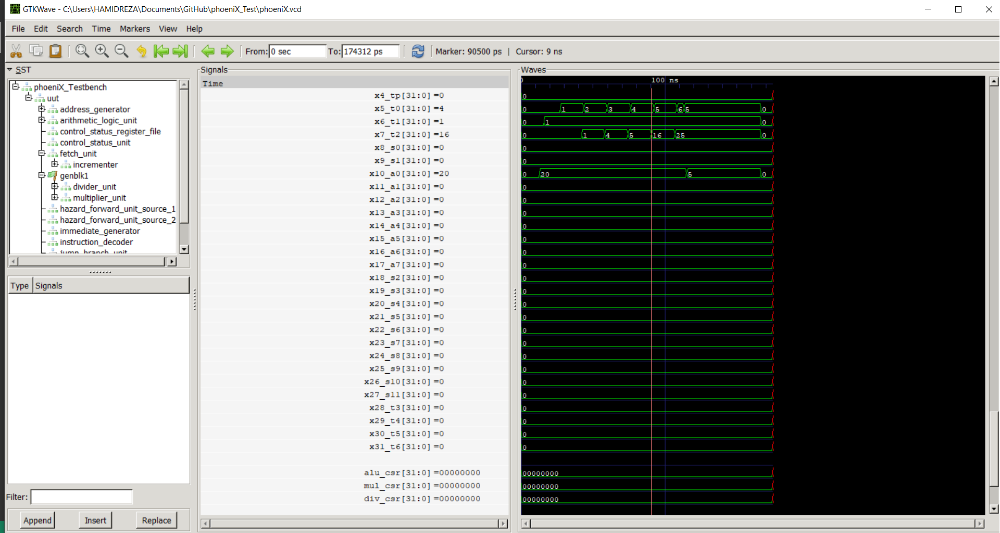

Computer Organization - Spring 2024
==============================================================
## Iran Univeristy of Science and Technology
## Assignment 1: Assembly code execution on phoeniX RISC-V core

- Name:Hamid Reza Tizpar
- Team Members:sadra same,Hamid Reza Rajab
- Student ID:400411306
- Date:2024.05.26

## Report
- Wirte your report and the final result of the assembly code here!

## question1:
In order to design a program that implements quicksort, we must design a return function, since it is very difficult to make return functions in assembly languages, we use the following algorithm:
For quicksort coding with riscv language, we consider the first row of our values array as the pivot and approach each other from both sides of the array, in the "LR" label from left to right and in the "RL" label from right to left, the label that goes from left to It moves right on the channels and looks for a value less than the pivot, and the label that moves from right to left looks for a value greater than the pivot. When the first label finds its desired value, the second label starts looking for its desired value. And when both find their values, then they are moved together in the chng label
If the first label finds a value and the second label reaches the desired value of the first label in the same directory number, that number of the directory must be selected as the new pivot and the "pivot" label is executed.
Now, the end of the range we considered for sorting is less and up to the new pivot, and we save the address of the previous pivot so that when the start pointer reaches the end pointer of the range, after that we consider the previous pivot as the end of the range. 
Likewise, when the beginning of the range reaches the end of the main range, our values will be sorted.

## result_1:
our_values:1,2,3,4,5,16

## question2:
   In this code, a binary search is used to find the square root of the input value. The algorithm starts with an initial test value of 1 and iteratively increments it by a factor of 4 (shifts 2 bits to the left) until the test value exceeds the input value. At this point, the square root is found and the result is returned in a0. 
   the square root of integers is calculated accurately But about numbers whose their square root is not an integer,for example '10' (which square root is between 3 and 4),it is rounded to the number 4.

## result_2:
a0=5

- Attach the waveform image to the README.md file

## Result1

## Result2
